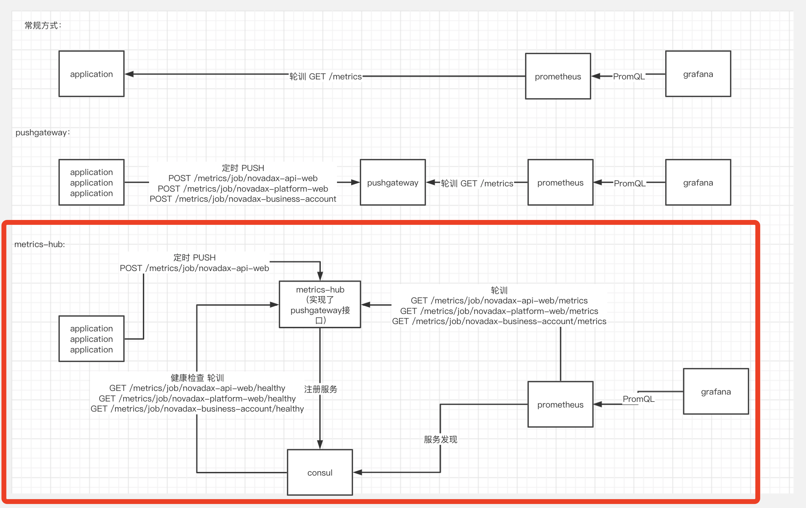

# metrics-hub
代替prometheus pushgateway，支持集群、没有一致性冲突  
客户端可以把 metrics-hub 当作 pushgateway 使用

### 资源使用情况  
* 容器大小  
```
REPOSITORY               TAG                   IMAGE ID            CREATED             SIZE
cloverzrg/metrics-hub    latest                8441b7c11f4d        2 weeks ago         20.8MB
```  
* 在60个application推送的情况下，平均CPU不超过1%，内存一般不超过10M（取决于metrics的大小）


### 使用  
##### 一、部署 consul
该步骤可参考网上教程

##### 二、启动 metrics-hub `docker-compose up -d`
```yaml
version: '3.3'

services:
  metrics-hub:
    image: cloverzrg/metrics-hub
    container_name: metrics-hub
    environment:
      TZ: Asia/Shanghai
      HTTP_EXTERNAL_URL: http://10.106.11.188:9091
      CONSUL_ADDRESS: xxx:8500
      CONSUL_TOKEN: xxx
    ports:
      - 9091:9091
    restart: always
    network_mode: bridge
```

##### 三、prometheus 添加配置  
```yaml
  - job_name: 'consul-prometheus'
    scrape_interval: 15s
    scrape_timeout: 5s
    honor_labels: true
    consul_sd_configs:
      - server: 'consul-ip:8500'
        token: 'consul-token'
    relabel_configs:
    - source_labels: [__meta_consul_tags]
      regex: .*prometheus-metrics.*
      action: keep
    - source_labels: ['__meta_consul_service_metadata_metrics_path']
      regex:         '(.*)'
      target_label:  '__metrics_path__'
      replacement:   '$1'
```

##### 四、客户端配置
把 metrics-hub 当作 pushgateway 使用，如 spring 下添加配置
```properties
management.metrics.export.prometheus.pushgateway.enabled=true
management.metrics.export.prometheus.pushgateway.push-rate=PT15s
management.metrics.export.prometheus.pushgateway.job=test@hostname.localhost
management.metrics.export.prometheus.pushgateway.grouping-key.application=test
management.metrics.export.prometheus.pushgateway.grouping-key.instance=hostname.localhost
management.metrics.export.prometheus.pushgateway.base-url=http://metrics-hub:9091
```


### 常规方式、pushgateway、metrics-hub三折比较

